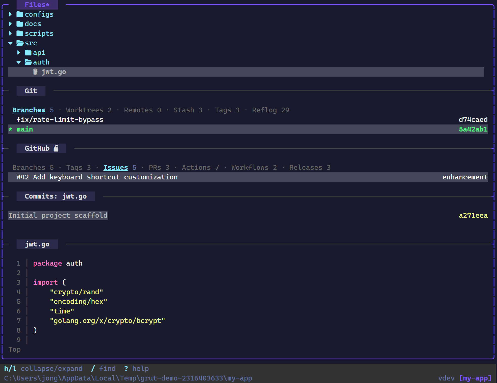
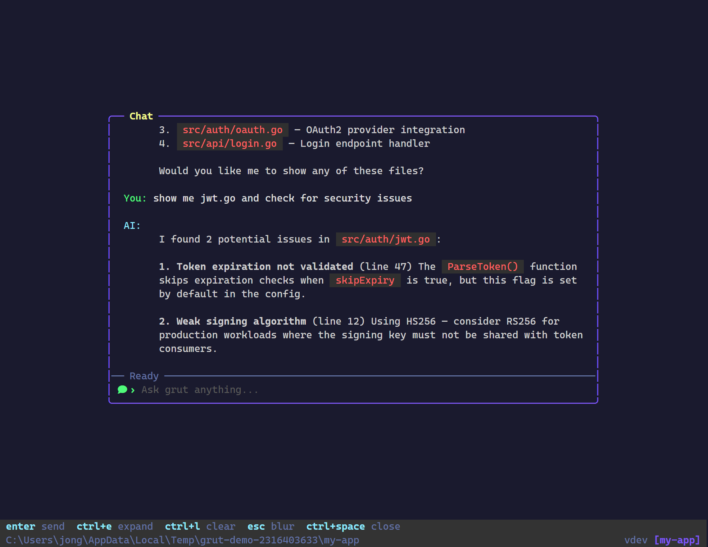
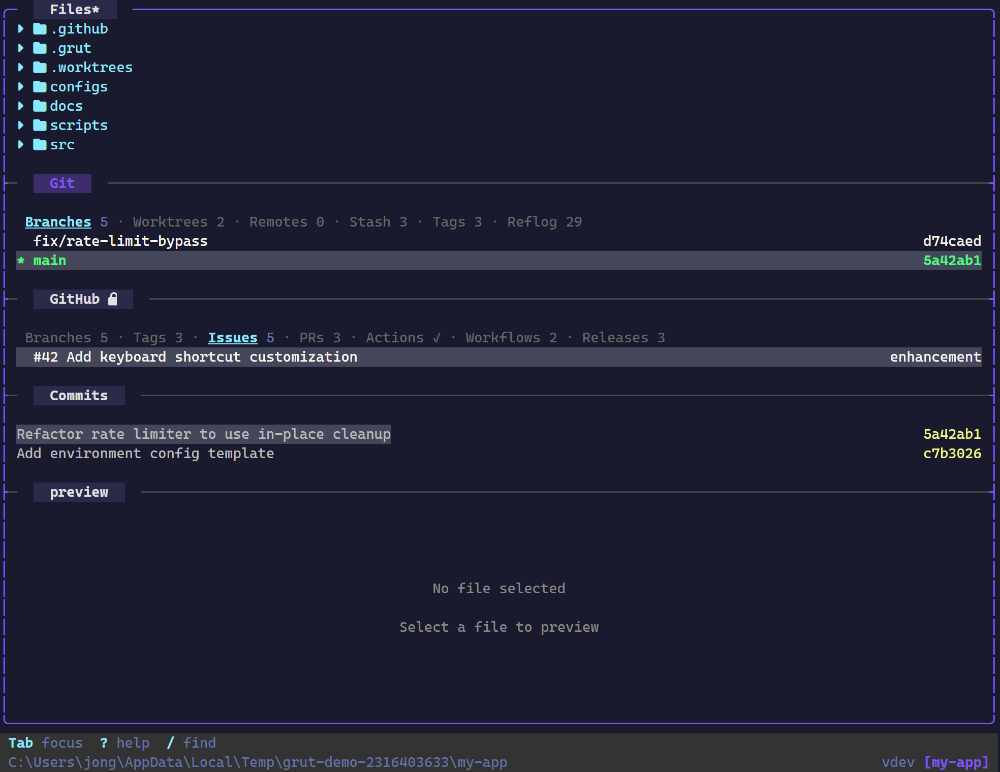
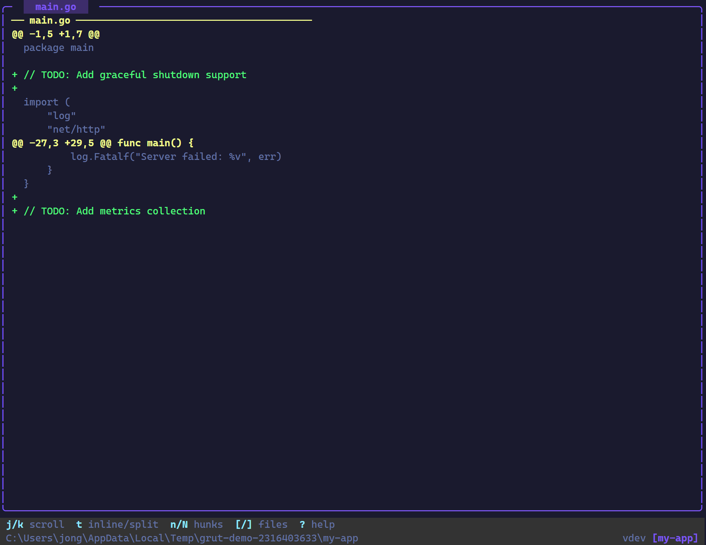
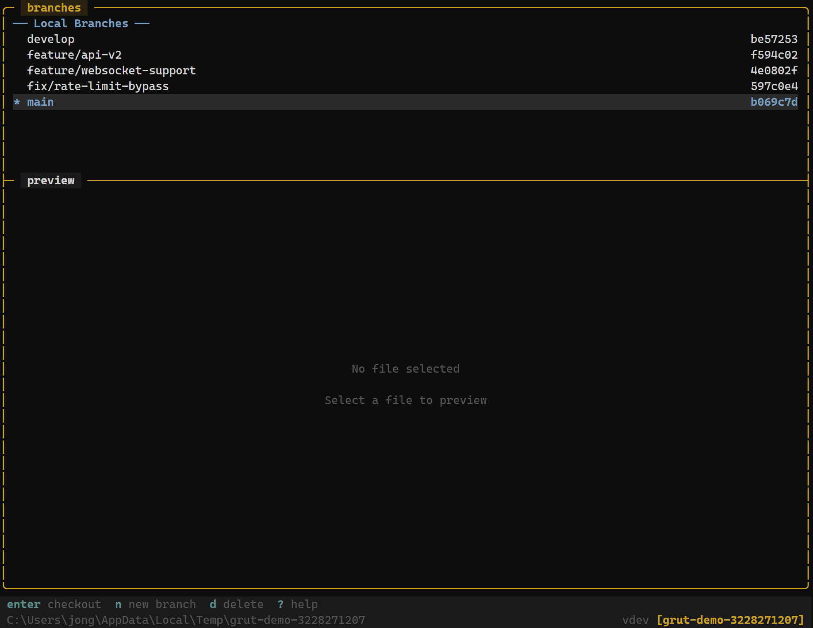
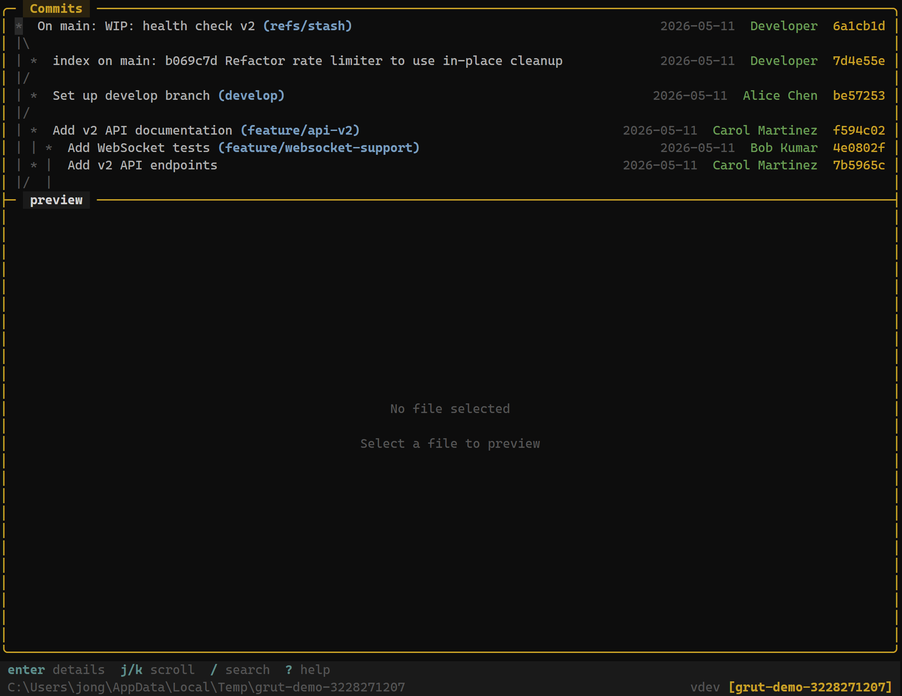
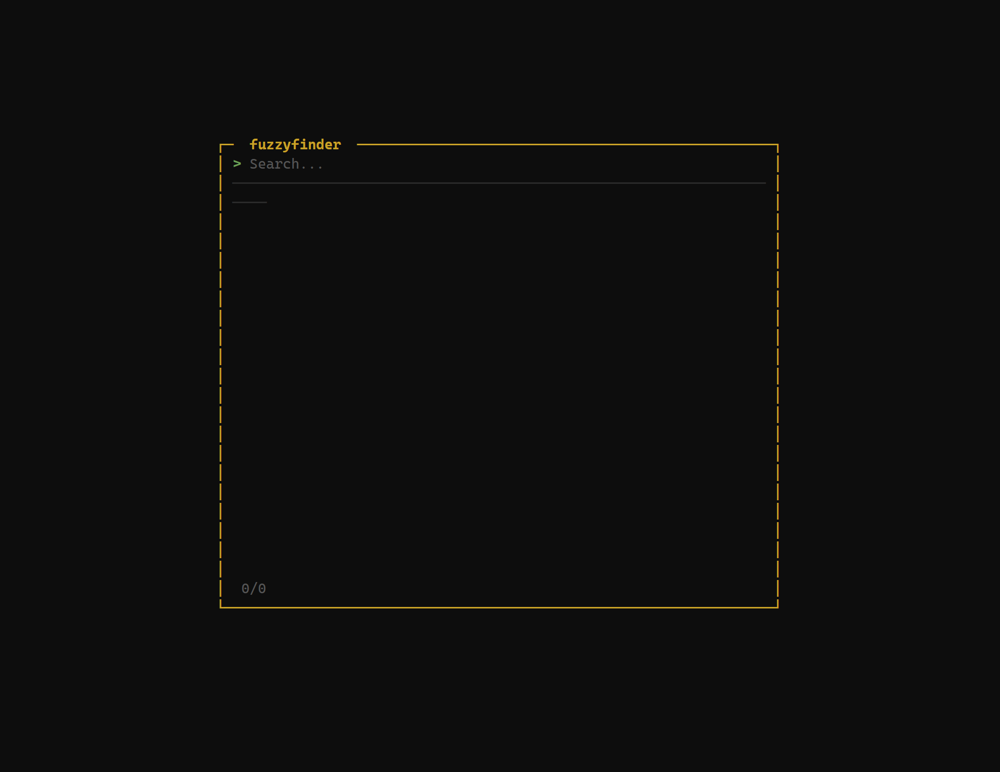
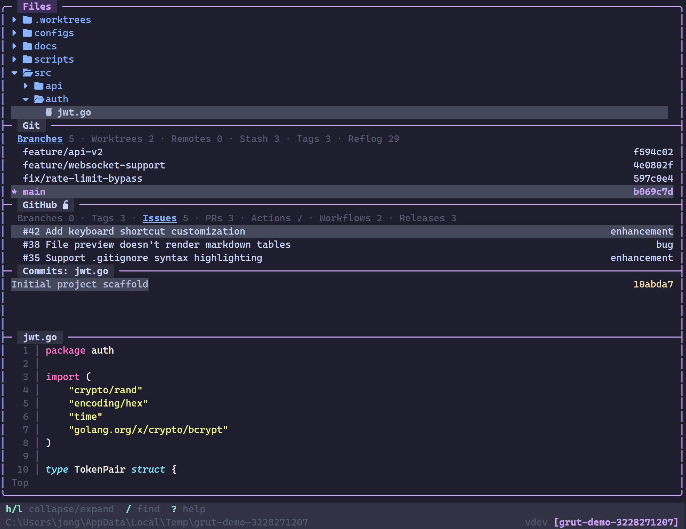
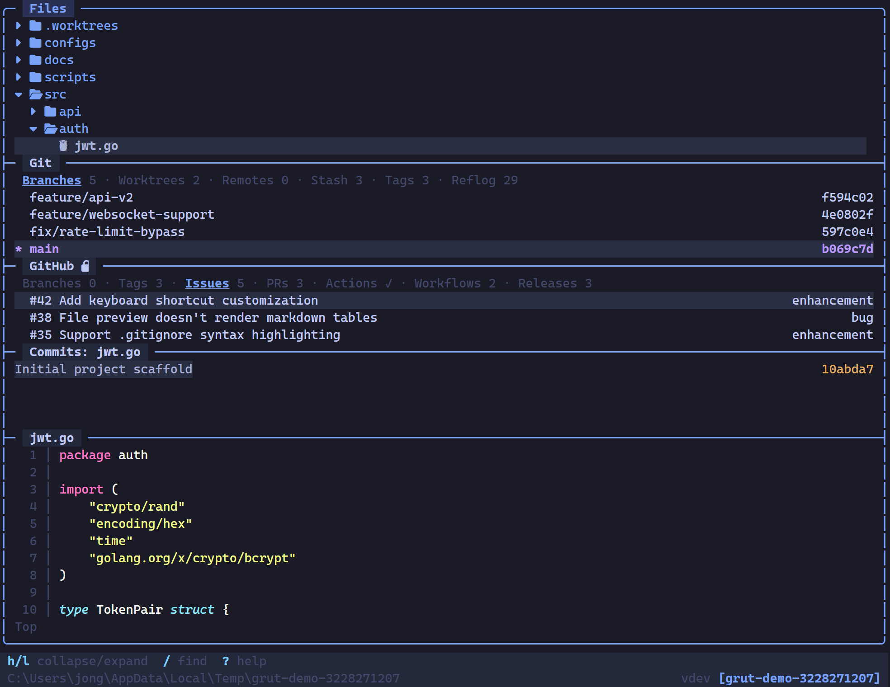
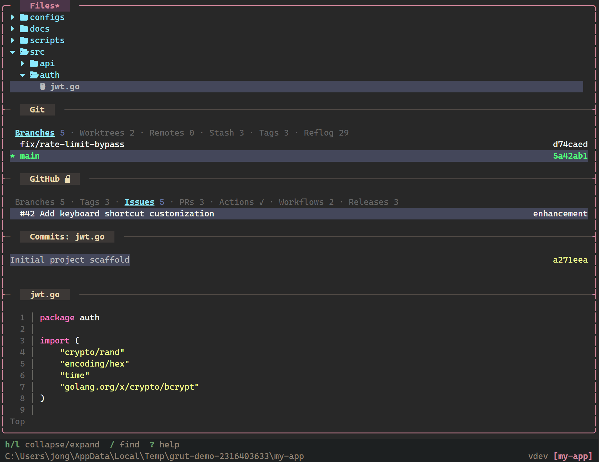

<p align="center">
  
</p>

<p align="center">

[](https://github.com/jongio/grut/actions/workflows/ci.yml)
[](https://goreportcard.com/report/github.com/jongio/grut)
[](https://pkg.go.dev/github.com/jongio/grut)
[](LICENSE)
[](go.mod)
[](#)

</p>

<p align="center">
A reactive terminal UI for Git and GitHub where every panel talks to every other panel.
</p>

<p align="center">
  
</p>

## Why grut?

Files, Git, GitHub, and preview — all in one terminal, all aware of each other. Pick a branch and the file tree, commits, and preview update. Pick a file and commits filter to its history. Pick a PR and three panels reconfigure at once. No switching tools, no refreshing.

## Features

### Reactive Panels
- **Context-Aware** — Panels react to your selections. Select a branch, file, worktree, remote, stash, or PR and every other panel updates to match.
- **Commit-Files Mode** — Enter on a commit shows only that commit's changed files in the tree. Escape restores.
- **PR Triple-Sync** — Select a PR and file tree, commits, and preview all update simultaneously.
- **Git Filter** — `g` cycles through three modes: all files → git-changed → branch diff. Preview switches to diff mode automatically.

### Files
- **File Explorer** — Navigate your project with git status markers, Nerd Font icons, create/rename/delete
- **Fuzzy Finder** — `/` for instant file search
- **Syntax Highlighting** — 100+ languages via Chroma
- **Preview** — Adapts to show file content, issue/PR bodies, workflow details, or diffs depending on selection. Press `f` to toggle between file-on-disk and contextual diff view. Click and drag to select text, `y` to copy.
- **Inline Editor** — Press `e` in the preview panel to edit files directly. `Ctrl+S` saves, `Escape` discards.

### Git
- **Status & Staging** — Stage, unstage, discard with single keystrokes. Partial staging for individual hunks and lines.
- **Branches, Worktrees, Stash, Tags, Remotes, Reflog** — Each as a dedicated tab with full CRUD operations.
- **Diff** — Inline and side-by-side modes with hunk navigation.
- **Log** — Commit graph with ASCII visualization.
- **Merge, Rebase, Blame, Bisect, Undo/Redo** — Complete git workflow without leaving the terminal.

### GitHub
- **Issues, Pull Requests, Actions, Workflows, Releases** — Each as a tab with filters and preview integration.
- **Merge PRs** — Merge pull requests with merge commit, squash, or rebase strategies and optional branch cleanup.
- **Workflow Dispatch** — Trigger CI/CD workflows with parameters from the TUI.

### AI Chat
- Built-in chat powered by **GitHub Copilot** — read/write files, run git commands, search code, interact with issues and PRs.
- AI-powered commit messages, conflict resolution, code review, and PR descriptions.
- Collapsed, expanded, and full-screen overlay modes.

### Interface
- **Themes** — Default, Catppuccin, Tokyo Night, Gruvbox, plus custom TOML themes.
- **Session Persistence** — Saves and restores layout on restart.
- **Self-Update** — `grut update` upgrades in-place.

See the [Roadmap](ROADMAP.md) for what's coming next.

<details>
<summary><strong>Screenshots</strong></summary>

### AI Chat


### Git Info


### Git Diff


### Git Branches


### Git Log


### Fuzzy Finder


### File Explorer & Preview


</details>

<details>
<summary><strong>Themes</strong></summary>

### Default


### Catppuccin


### Tokyo Night


### Gruvbox


</details>

## Installation

### Shell script (Linux / macOS)

```bash
curl -fsSL https://raw.githubusercontent.com/jongio/grut/main/install.sh | sh
```

To install a specific version:

```bash
curl -fsSL https://raw.githubusercontent.com/jongio/grut/main/install.sh | sh -s -- v0.1.0
```

### PowerShell script (Windows)

```powershell
irm https://raw.githubusercontent.com/jongio/grut/main/install.ps1 | iex
```

To install a specific version:

```powershell
$v="v0.1.0"; irm https://raw.githubusercontent.com/jongio/grut/main/install.ps1 | iex
```

### Go Install

```bash
go install github.com/jongio/grut@latest
```

### Binary Download

Download from [GitHub Releases](https://github.com/jongio/grut/releases).

### Updating

```bash
grut update  # Downloads and installs the latest release
```

## Quick Start

```bash
grut              # Launch file explorer in current directory
grut /path/to/dir # Open specific directory
grut update       # Update grut to the latest release
grut doctor       # Check terminal, config, Git, GitHub, and AI readiness
grut version      # Print the version
```

## Commands

grut is primarily a TUI, but it also exposes subcommands for scripting and setup. Run `grut <command> --help` for full options.

| Command | Description |
|---|---|
| `grut [path]` | Launch the TUI in the current or given directory |
| `grut version` | Print the version of grut |
| `grut update` | Update grut to the latest release |
| `grut doctor` | Check environment health (`--json` for issue reports/CI logs) |
| `grut status` | Print a summary of the working tree status |
| `grut config` | Inspect configuration (`check`, `get <key>`, `defaults`) |
| `grut theme` | Inspect themes (`theme list`) |
| `grut keys` | Print keybindings (`--filter`, `--section`, `--sections`, `--json`) |
| `grut clean` | Remove transient session and diagnostic data |
| `grut completion` | Generate shell completion scripts |
| `grut run <shortcut>` | Execute an AI-powered git workflow shortcut |
| `grut ext` | Manage extensions (`install`, `remove`, `enable`, `disable`, `create`, `info`) |
| `grut report` | View crash reports and file GitHub issues |
| `grut mcp` | Run grut as an MCP server (`mcp tools` lists exposed tools) |

## CLI Flags

| Flag | Description |
|---|---|
| `--help`, `-h` | Show usage information |
| `--version`, `-v` | Print the version and exit |
| `--demo` | Launch with a demo project to explore grut |
| `--scenario NAME` | Launch a guided demo scenario (`list`, `branch-review`, `conflict-resolution`, `extensions`) |
| `--demo-keep` | Keep the generated demo repository after exit and print its path |
| `--no-ai` | Disable AI features for this session |
| `--layout NAME` | Start with a layout for this launch (`explorer`, `git`, `review`, `agent`, `full`) |
| `--cpu-profile FILE` | Write CPU profile to FILE (dev/debug) |
| `--mem-profile FILE` | Write memory profile to FILE (dev/debug) |
| `--pprof PORT` | Start pprof server on localhost:PORT (dev/debug) |
| `--reset-welcome` | Reset first-run state so the welcome screen shows on next launch |

A background update check runs on every launch and notifies you when a new version is available.

## Demo Scenarios

Use `grut --demo --scenario list` to print guided scenarios. Launch one with `grut --demo --scenario branch-review`, `conflict-resolution`, or `extensions`. Each scenario opens a seeded repository, selects a focused layout/panel, and displays `.grut/demo-scenario.md` in the TUI with walkthrough steps. Add `--demo-keep` to retain the generated path for local bug reports or repro notes.

## Nerd Font Icons

grüt displays file-type icons using [Nerd Font](https://www.nerdfonts.com/) glyphs. For the best experience, install a Nerd Font (e.g. **0xProto**, **FiraCode**, **JetBrainsMono**) and configure your terminal to use it.

When `icon_mode` is set to `"auto"` (the default), grüt detects known nerd-font-capable terminals (WezTerm, kitty, Alacritty, iTerm, Ghostty, Windows Terminal, etc.) and enables icons automatically. You can also force it:

```toml
# ~/.config/grut/config.toml
[file_tree]
icon_mode = "nerd"   # always use nerd font icons
# icon_mode = "ascii" # always use plain ASCII
```

Or set the environment variable `GRUT_NERD_FONT=1` to enable nerd icons in any terminal.

## Keybindings

See [docs/keybindings.md](docs/keybindings.md) for the complete reference.

| Key | Action |
|-----|--------|
| `j` / `k` | Navigate up/down |
| `h` / `l` | Collapse/expand |
| `Enter` | Open/select |
| `1`–`5` | Focus panel (File Tree, Git Info, GitHub, Commits, Preview) |
| `/` | Fuzzy finder |
| `?` | Help overlay |
| `R` | Refresh all data + preview |
| `F` | Fetch all remotes |
| `P` | Push |
| `s` | Stage file |
| `x` | Delete / cancel |
| `g` | Cycle filter: all → git changed → branch diff |
| `e` | Edit file inline (in preview panel) |

## Configuration

Config file: `~/.config/grut/config.toml` (Linux/macOS) or `%APPDATA%\grut\config.toml` (Windows)

See [docs/configuration.md](docs/configuration.md) for all options.

## Building from Source

```bash
git clone https://github.com/jongio/grut.git
cd grut
go build -o grut .
./grut
```

Or with Mage:

```bash
mage build
```

## Development

grut uses [Mage](https://magefile.org/) for development workflows:

```bash
mage install    # Run tests, build bin/grut-dev, add to PATH (default target)
mage test       # Run all unit tests
mage preflight  # Pre-commit checks: fmt, tidy, vet, build, test, vulncheck
mage vet        # Run go vet
mage lint       # Run golangci-lint (falls back to go vet)
mage fmt        # Format all Go source files
mage clean      # Remove bin/ directory
```

You can also use standard Go commands directly:

```bash
go build ./...   # Build all packages
go test ./...    # Run all tests
go vet ./...     # Vet all packages
```

## Tech Stack

- **Go 1.26.5** + **Bubble Tea v2** (TUI) + **Lipgloss v2** (styling) + **Bubbles v2** (widgets)
- **Chroma v2** (syntax highlighting) + **Glamour** (markdown rendering)
- **fsnotify** (filesystem watching) + **mimetype** (file type detection)
- **TOML** configuration via go-toml/v2
- **Cobra** CLI framework

## License

MIT
